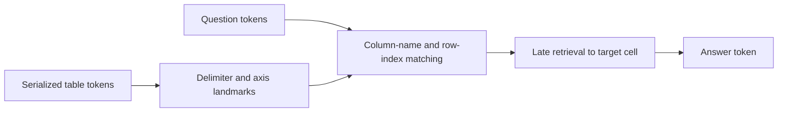

---
layout: distill
title: "Structure from Sequence: Mechanisms of Tabular Retrieval"
description: Master's Thesis
date: 06/02/2026
importance: 1
category: academic 
related_publications: false
blog_vis_root: /assets/blog_vis/

featured: true
mermaid:
  enabled: true
  zoomable: true
code_diff: true
map: true
chart:
  chartjs: true
  echarts: true
  vega_lite: true
tikzjax: true
typograms: true

authors:
  - name: Siddharth Parekh
    affiliations:
      name: Carnegie Mellon University

# bibliography: 

# Optionally, you can add a table of contents to your post.
# NOTES:
#   - make sure that TOC names match the actual section names
#     for hyperlinks within the post to work correctly.
#   - we may want to automate TOC generation in the future
#     using jekyll-toc plugin (https://github.com/toshimaru/jekyll-toc).
toc:
  - name: Overview
  - name: Why tables?
  - name: Related work
  - name: "The task: structural question answering"
  - name: What the models can do
  - name: From row counting to row matching
  - name: A proposed table-reading pipeline
  - name: "Stage 1: establishing column structure"
  - name: "Stage 2: matching the question to the table"
  - name: "Stage 3: retrieving the target cell"
  - name: Comparing Base and Instruct
  - name: What goes wrong?
  - name: What formatting helps?
  - name: Current hypotheses
  - name: Current evidence and open questions
--- 

<style>
d-article h2 {
  margin-top: 2rem !important;
  margin-bottom: 1rem !important;
}

d-article h3 {
  margin-top: 1.6rem !important;
  margin-bottom: 0.7rem !important;
}

d-article p {
  margin-bottom: 0.85rem !important;
  line-height: 1.55;
}

d-article table {
  font-size: 0.92rem;
}

.blog-viz {
  display: block;
  width: 100%;
  max-width: 100%;
  height: auto;
  margin: 18px auto 8px;
}

.blog-viz-grid {
  display: grid;
  grid-template-columns: repeat(auto-fit, minmax(260px, 1fr));
  gap: 16px;
  align-items: start;
  margin: 18px 0 8px;
}

.blog-viz-grid img {
  width: 100%;
  height: auto;
  display: block;
}

.blog-viz-item {
  margin: 0;
}

.blog-viz-label {
  color: var(--global-text-color);
  opacity: 0.7;
  font-size: 0.85rem;
  margin-top: 6px;
}

.attn-viz-frame {
  width: 100%;
  height: 600px;
  overflow: auto;
  background: transparent;
  border: none;
}

.attn-viz-frame iframe {
  min-width: 100%;
  display: block;
}

.attn-viz-frame + figcaption,
.blog-viz + figcaption,
.blog-viz-grid + figcaption {
  color: var(--global-text-color);
  opacity: 0.75;
  margin-top: 8px;
}

.draft-note {
  color: var(--global-text-color);
  opacity: 0.75;
  font-size: 0.95rem;
}
</style>

## Overview

My thesis asks a simple question with a surprisingly slippery answer: **how do decoder-only language models read a table?**

A table is a two-dimensional object. A transformer, however, receives a
one-dimensional sequence of tokens: header text, cell text, delimiters, newline
tokens, and then a question. The model is never handed a dataframe. If it
answers a table lookup question correctly, it has somehow recovered enough of
the latent row-column structure from the serialized text to route the question
to the right cell.

The central claim of this project is that table lookup is not one monolithic
skill. In Llama-3.1-8B, the current evidence points to a rough two-stage
pipeline:

1. **Matching.** Early and middle layers match the queried column name and row
   index back to the corresponding header and index tokens in the table.
2. **Retrieval.** Later layers route attention to the row-column intersection
   and assemble the final answer.

For example, the table we think of as a two-dimensional object:

| Row | City     | Score |
| --- | -------- | ----- |
| 1   | Boston   | 82    |
| 2   | Chicago  | 91    |
| 3   | Seattle  | 77    |

reaches the model as a text sequence:

```text
| Row | City | Score |
| --- | --- | --- |
| 1 | Boston | 82 |
| 2 | Chicago | 91 |
| 3 | Seattle | 77 |

Question: What is the Score for row 2?
```

We see the line breaks rendered, but the same input is closer to the 1-dimensional:

```text
| Row | City | Score |\n| --- | --- | --- |\n| 1 | Boston | 82 |\n| 2 | Chicago | 91 |\n| 3 | Seattle | 77 |\n\nQuestion: What is the Score for row 2?
```

And after tokenization, the model sees only a sequence of integer token IDs. The exact IDs are tokenizer-specific, but structurally the input has become something like:

```text
[91, 4213, 765, 9102, 765, 14877, 765, 198, 91, 4521, 765, 4521, 765, 4521, 765, 198, 91, 220, 16, 765, 15309, 765, 220, 6086, 765, 198, 91, 220, 17, 765, 25342, 765, 220, 8061, 765, 198, 91, 220, 18, 765, 23128, 765, 220, 2813, 765, 271, 14924, 25, 3639, 374, 279, 14877, 369, 2872, 220, 17, 30]
```

The core tension is that the row-column geometry is not a native part of the
input. It has to be reconstructed from delimiters, line breaks, header tokens,
and repeated cell positions in the serialized text.

This post is a summary of the thesis as it stands. It serves as research log and a preliminary draft: the main story is already visible, but some experiments are still running and several causal tests remain open.

## Why tables?

Language models are often asked to operate over structured data: pasted CSVs,
markdown tables, tool outputs, spreadsheet snippets, database rows, JSON
objects, logs, and reports. In deployed systems, the model may also have access
to tools that parse the data for it. But even when tools help, the model's
native ability to infer structure from a prompt still matters. It determines
what the model notices, how it follows references, how robust it is to
formatting changes, and when it silently loses track of the object it is
supposed to reason about.

Tables are a good minimal case. They are simple enough to define precise
lookup tasks, but structured enough that success cannot be explained by local
next-token statistics alone. To answer "what is the value in column `Score`,
row `2`?", the model must identify a column axis, identify a row axis, and
retrieve the value at their intersection.

That makes tables a useful bridge between two interpretability questions:

1. How do models extract latent structure from one-dimensional text?
2. Which internal components make that structure behaviorally useful?

The same question appears in richer forms elsewhere. A JSON object is a flat
sequence with latent hierarchy. Code is a flat sequence with scope, binding,
and control flow. A game transcript is a flat sequence with a latent board
state. Tables let us study this broader problem in a controlled setting where
the "right answer" is easy to score.

## Related work

This project is closest in spirit to mechanistic interpretability work that
reverse-engineers model behaviors into circuits. The clearest inspiration is
[IOI](https://arxiv.org/abs/2211.00593), the Indirect Object Identification
circuit in GPT-2 small. IOI showed that a natural language behavior could be
explained in terms of specific attention heads and causal interventions, rather
than only with aggregate attention visualizations. My table work follows the
same ambition: find the heads, characterize their roles, and then intervene on
them.

There is also a natural connection to the Transformer Circuits work on
[induction heads](https://transformer-circuits.pub/2022/in-context-learning-and-induction-heads/index.html)
and earlier circuit methodology. Induction heads are a canonical example of
models learning a reusable sequence operation: find a previous pattern, then
copy or continue it. Table lookup is not the same operation, but it has a
similar flavor. The model must find a structural landmark in context, bind a
query token to it, and use that binding downstream.

A second related thread studies whether sequence models learn latent world
models. In
[Emergent World Representations](https://arxiv.org/abs/2210.13382), an Othello
sequence model develops an internal representation of board state despite being
trained only on move sequences. Tables pose a humbler version of the same
question: does a decoder trained on text build internal row and column
coordinates when all it observes is a serialized table?

Finally, there is a large table-question-answering literature, including
specialized table encoders such as
[TAPAS](https://arxiv.org/abs/2004.02349). Those systems often modify the input
representation or architecture to make tables easier to consume. Here the
object of study is different: I ask how ordinary decoder-only LLMs, with no
explicit table embedding, recover enough table structure from plain text.

<!-- <d-figure class="l-page">
  
  <figcaption>
    The project sits between circuit discovery and structured-data QA: not a
    new table model, but a mechanistic account of how existing LLMs read
    serialized tables.
  </figcaption>
</d-figure> -->

## The task: structural question answering

The main task is deliberately plain. The model receives a table and a question
whose answer is a cell value inside that table:

```text
| Row | Name | Score | City |
|---:|---|---:|---|
| 1 | Ada | 91 | Boston |
| 2 | Bea | 84 | Denver |
| 3 | Cal | 77 | Austin |

Question: What is the value in the 'Score' column, row 2?
Answer:
```

The correct answer is `84`. The answer is determined entirely by the prompt.
This makes the task useful for interpretability: success requires in-context
structure processing rather than memorized world knowledge.

The current experiments use real tables serialized as markdown or CSV. The
main models are Llama-3.1-8B and Qwen-2.5-7B, each in base and Instruct
variants, run through TransformerLens so attention patterns and residual
activations can be inspected.

I study the task from five angles:

1. **Behavior.** Can the model answer cell-lookup questions exactly?
2. **Residual probes.** Can linear probes decode row, column, or cell-position
   labels from delimiter-token residual activations?
3. **Attention alignment.** Do heads place more attention than a causal-uniform
   baseline on same-row or same-column table regions?
4. **Question routing.** When a question is appended, do question-side tokens
   attend to the correct cell, target column header, target row index, or other
   structural regions?
5. **Causal interventions.** What happens when candidate matching or retrieval
   heads are mean-ablated?

<!-- <d-figure class="l-page">
  
  <figcaption>
    The lookup task factors naturally into column matching, row matching, and
    cell retrieval.
  </figcaption>
</d-figure> -->

## What the models can do

Behaviorally, the task is not solved by default, but the model improves sharply
when the prompt gives it an explicit row-index column.

| setting | exact-match |
|---|---:|
| Llama base, zero-shot, no row-index | 0.439 |
| Llama base, zero-shot, + row-index | 0.768 |
| Llama base, 2-shot, + row-index | 0.862 |
| Llama Instruct, zero-shot, + row-index | **0.912** |
| Llama Instruct, base-style 2-shot text prompt, + row-index | 0.876 |
| Llama base, markdown pooled | 0.550 |
| Llama base, CSV pooled | 0.483 |
| Llama Instruct, markdown pooled | 0.678 |
| Llama Instruct, CSV pooled | 0.563 |

Two facts jump out.

First, row indexing matters enormously. For Llama base, adding the row-index
column improves exact match from 0.439 to 0.768. This is not a tiny prompt
polish; it changes the task the model is doing internally.

Second, markdown is consistently easier than CSV. In the pooled runs, markdown
beats CSV by about 7 points for Llama base and 12 points for Llama Instruct.
That points toward a formatting story: some serializations create better
landmarks for the model than others.

<d-figure class="l-page">
  
  <figcaption>
    The strongest behavioral intervention is not model choice, but giving the
    model an explicit row anchor.
  </figcaption>
</d-figure>

## From row counting to row matching

The row-index result changed how I think about the task. Without an explicit
index column, "row 7" means "count down to the seventh data row." With an index
column, "row 7" means "match the token `7` in the question to the token `7` in
the first column." That is a very different computation.

The error analysis supports this distinction. Define `off_by_row` as an error
where the model retrieves from the right column but the wrong row. Without a
row-index column, this is the dominant failure mode:

| config | exact | off_by_row (% of errors) | wrong_col_same_row | not_in_table |
|---|---:|---:|---:|---:|
| base zero-shot, no row-index | 0.439 | **62.1%** | 4.0% | 25.9% |
| base zero-shot, + row-index | 0.768 | 23.5% | 17.3% | 41.0% |
| Instruct, no row-index | 0.678 | **73.7%** | 5.2% | 11.8% |
| Instruct, + row-index | 0.912 | 12.0% | 32.0% | 30.1% |

Mechanistically, this fits the token-routing results. The question token group
corresponding to the row keyword itself has almost no useful routing signal:
`row_keyword -> header` peaks around 0.06. The row number, by contrast, can
route to the row-index column. The model is not robustly finding rows by
counting or by a natural row name; it is using the explicit index column as a
load-bearing anchor.

<d-figure class="l-page">
  
  <figcaption>
    Adding a row-index column converts a brittle counting problem into a
    matching problem.
  </figcaption>
</d-figure>

## A proposed table-reading pipeline

The working model is that cell lookup decomposes into a pipeline. The stages
are not perfectly modular, but they separate strongly by layer depth.



The score-based circuit map supports this depth-wise separation. In Llama
Instruct on markdown tables with row indices, matching metrics peak in early
and middle layers. Retrieval metrics peak later:

| stage | representative metrics | peak layers | score-weighted centroid |
|---|---|---:|---:|
| Matching | column-name -> header, row-index -> header, row/column alignment | L4-L8 | about L8-L15 |
| Retrieval | correct-cell attention, structural precision, table precision | L17-L24 | about L18-L21 |

The important point is not that there are exactly two clean modules. The
important point is that the model appears to first establish useful structural
bindings, then use those bindings later when generating the answer.

<d-figure class="l-page">
  
  <figcaption>
    The strongest structural signals do not all peak at the same depth.
    Matching appears earlier; correct-cell retrieval appears later.
  </figcaption>
</d-figure>

## Stage 1: establishing column structure

Before the model can answer a question, it needs a way to represent table axes.
The attention-alignment analysis asks whether heads attend more than a
causal-uniform baseline to same-row or same-column regions. This is deliberately
weaker than "the head answers the question"; it measures whether the head
respects table geometry at all.

Several heads show strong column alignment. In Llama Instruct markdown runs,
heads such as L4H16, L8H11, L14H19, and L10H2 place unusually high mass along
the column axis. The same analysis also finds row-aligned heads, though row
structure is much less useful behaviorally unless a row-index column is present.

This is the first place where the "structure from sequence" story becomes
visible. The model does not receive a column identifier. But delimiter tokens,
header tokens, and repeated row formatting create landmarks that some heads can
use as implicit coordinates.

<d-figure class="l-page">
  <div class="blog-viz-grid">
    <div class="blog-viz-item">
      
      <div class="blog-viz-label">Row alignment</div>
    </div>
    <div class="blog-viz-item">
      
      <div class="blog-viz-label">Column alignment</div>
    </div>
    <!-- <div class="blog-viz-item">
      
      <div class="blog-viz-label">Combined alignment</div>
    </div> -->
  </div>
  <figcaption>
    Alignment scores identify heads that treat serialized table tokens as if
    they live on row and column axes.
  </figcaption>
</d-figure>

<!-- <d-figure class="l-page">
  <div class="blog-viz-grid">
    <div class="blog-viz-item">
      
      <div class="blog-viz-label">Accuracy by layer</div>
    </div>
    <div class="blog-viz-item">
      
      <div class="blog-viz-label">Probe metrics</div>
    </div>
  </div>
  <figcaption>
    Probe results are a complementary view: attention shows routing; probes ask
    whether row and column labels are linearly recoverable from activations.
  </figcaption>
</d-figure> -->

## Stage 2: matching the question to the table

Once a question is appended, the model must bind words in the question to
specific table landmarks. This is where the most interpretable head story
appears.

The head L8H11 is currently the best candidate for a matching hub. In Llama
Instruct, it scores highly on both axes:

| head | role | representative scores |
|---|---|---:|
| L8H11 | matching hub | colname -> header 0.78, rowidx -> header 0.65, align_col 0.56 |
| L4H16 | column matching | colname -> header 0.55, align_col 0.56 |
| L14H19 | column matching | colname -> header 0.67, rowidx -> header 0.42 |
| L8H1 | column matching | colname -> header 0.65 |
| L5H8/L5H9/L5H11 | row-index matching cluster | rowidx -> header about 0.26-0.47 |

The distinction between the row token groups matters. The token "row" is not
very useful. The row index itself is. The model seems to route the numeric row
token to the explicit index column and route the column-name tokens to the
header row.

<d-figure class="l-page">
  
  <figcaption>
    Token-level routing separates useful query content from nearly dead query
    words. Column names and row indices route; the word "row" mostly does not.
  </figcaption>
</d-figure>

<d-figure class="l-page">
  <div class="attn-viz-frame">
    <iframe id="attn-viz-1"
            src="{{ page.blog_vis_root | append: '/html/llama-instruct-L8H11.html' | relative_url }}"
            frameborder="0" scrolling="no"
            style="border:0; display:block;">
    </iframe>
  </div>
  <figcaption>
    Llama Instruct L8H11 on markdown tables. Hover any
    token to see where it attends; click to lock. Export source:
    `src/visualize_attention_head.py`.
  </figcaption>
</d-figure>

<d-figure class="l-page">
  <div class="attn-viz-frame">
    <iframe src="{{ page.blog_vis_root | append: '/html/llama-instruct-L8H11-csv.html' | relative_url }}"
            frameborder="0" scrolling="no"
            style="border:0; display:block;">
    </iframe>
  </div>
  <figcaption>
    The same head on CSV tables. This comparison makes the format-dependence
    concrete rather than abstract.
  </figcaption>
</d-figure>

## Stage 3: retrieving the target cell

The retrieval stage appears later. The strongest correct-cell and structural
precision heads in Llama Instruct live around layers 16-24:

| head | representative scores |
|---|---:|
| L17H24 | correct_cell 0.58, precision_structural 0.65 |
| L16H1 | correct_cell 0.53, precision_structural 0.61 |
| L24H27 | correct_cell 0.50, precision_structural 0.69 |
| L16H19/L16H8 | correct_cell 0.32-0.44 |
| L22H12/L22H13/L22H14 | correct_cell 0.32-0.37 |

These heads are less cleanly "the answer head" than one might hope. Correct
cell attention is diffuse, and attention is not the whole computation. Still,
the depth profile is robust: metrics that directly involve the target cell peak
later than metrics that involve matching the query to headers and row indices.

<d-figure class="l-page">
  <div class="blog-viz-grid">
    <div class="blog-viz-item">
      
      <div class="blog-viz-label">Correct-cell attention</div>
    </div>
    <div class="blog-viz-item">
      
      <div class="blog-viz-label">Structural precision</div>
    </div>
  </div>
  <figcaption>
    Late heads route more directly to the table region needed for answering.
  </figcaption>
</d-figure>

## Comparing Base and Instruct

Instruction tuning improves the native chat setup, but the clean matched-prompt
comparison is more subtle. When Llama base and Llama Instruct both see the same
base-style 2-shot text prompt with row indices, exact match changes only from
0.862 to 0.876: a +0.014 gain.

That does not mean instruction tuning is irrelevant. It means the biggest
observed behavior gap mixes together weights, prompt format, and shot count.
Mechanistically, the head-level comparison suggests a more specific story:
matching is mostly pretrained, while retrieval shifts more under instruction
tuning.

Per-metric Base/Instruct Spearman correlations over all 1024 Llama heads:

| metric | Spearman |
|---|---:|
| align_row / align_combined / align_col | about 0.99 |
| column-name -> header | 0.95 |
| column-name axis mass | 0.92 |
| correct-cell attention | 0.87 |
| structural precision | 0.80 |
| table precision | 0.73 |
| row-index axis mass | 0.65 |

The near-identity of alignment and column-name matching heads suggests that
much of the table-axis machinery is already present in the base model. The
lower stability of retrieval and row-index routing suggests these later,
answer-facing computations are more affected by instruction tuning and prompt
format.

<d-figure class="l-page">
  <div class="blog-viz-grid">
    <div class="blog-viz-item">
      
      <div class="blog-viz-label">Base/Instruct head-rank stability</div>
    </div>
    <div class="blog-viz-item">
      
      <div class="blog-viz-label">Instruct co-localization</div>
    </div>
  </div>
  <figcaption>
    Matching heads are highly stable across base and Instruct; retrieval heads
    move more.
  </figcaption>
</d-figure>

## What goes wrong?

There are two main behavioral failure stories.

The first is row tracking. Without a row-index column, the model often retrieves
from the right column but the wrong row. This is the off-by-row failure described
above, and it is exactly the failure that row indices reduce.

The second is wide-table collapse. At first glance, accuracy appears to fall
for far-right columns. But after controlling for table width, the story changes:
the hard cases are not far-right columns; they are wide tables.

At a fixed width, accuracy is roughly flat across column position. The real
drop appears when tables have 11 or more columns:

| format/model | typical mid-width accuracy | 11+ column accuracy |
|---|---:|---:|
| Llama base, markdown | about 0.57 | 0.30 |
| Llama Instruct, markdown | about 0.71 | 0.59 |
| Llama base, CSV | about 0.50 | 0.23 |
| Llama Instruct, CSV | about 0.58 | 0.33 |

The regression view points the same way. Width is a stronger column-side error
driver than absolute column index, while row depth is the strongest
within-table driver overall.

<d-figure class="l-page">
  
  <figcaption>
    The apparent far-right-column failure is mostly a wide-table failure.
  </figcaption>
</d-figure>

The first causal interventions sharpen the story. In Llama Instruct with
row-indexed markdown tables, mean-ablation gives:

| ablated set | heads | exact | delta acc | main shift |
|---|---|---:|---:|---|
| baseline | none | 0.910 | - | - |
| hub | L8H11 | 0.896 | -0.014 | small change |
| column matching | L4H16, L14H19, L8H1, L10H2 | 0.774 | **-0.136** | not_in_table rises |
| row matching | L5H8, L5H9, L5H11, L14H17 | 0.882 | -0.028 | off_by_row rises |
| retrieval | L17H24, L24H27, L16H1 | 0.872 | -0.038 | not_in_table rises |
| random control | 12 random heads | 0.908 | -0.003 | inert |

The row-matching ablation is the cleanest mechanism-to-behavior link: off_by_row
errors rise from 9.7% to 29.6% of errors. The column-matching ablation causes
the biggest accuracy drop, but its dominant new failure is not "wrong adjacent
column." Instead, the model often leaves the table entirely. That suggests
column matching may be a prerequisite for the retrieval stage to stay anchored
to the table region at all.

<d-figure class="l-page">
  
  <figcaption>
    The first causal tests support specific roles for matching heads, especially
    row-index heads.
  </figcaption>
</d-figure>

## What formatting helps?

The mechanistic picture gives practical formatting advice:

1. **Include a row-index column.** This turns row lookup into token matching and
   removes the dominant off-by-row failure.
2. **Prefer markdown over CSV.** Markdown gives the model stronger visual and
   token-level landmarks.
3. **Keep tables narrow when possible.** The current failure threshold is around
   11 or more columns; position within a fixed-width table matters much less
   than width itself.
4. **Use stable, explicit headers.** The column-name matching heads need a clear
   header token to bind to.
5. **Ask with the same surface form used in the table.** If the table says
   `Score`, ask for `Score`, not a paraphrase, unless you have separately tested
   semantic header matching.

These are not just prompt-engineering tips. Each one corresponds to a proposed
internal operation: make row identity matchable, make columns landmarked, and
keep the retrieval region small enough that later heads can stay locked onto
the table.

## Current hypotheses

Here is the current thesis story in hypothesis form.

1. **Table lookup is a two-stage pipeline.** Early/mid layers match the
   question's column name and row index to table landmarks; late layers retrieve
   the target cell.
2. **Matching is mostly pretrained; retrieval is more instruction-sensitive.**
   Alignment and column-name matching are highly stable across base and
   Instruct, while retrieval and row-index routing shift more.
3. **L8H11 is a matching hub.** It is the clearest single head that routes both
   column-name and row-index information to table landmarks.
4. **Rows are found by index, not by row keyword.** The row-index column is the
   load-bearing row anchor; the word "row" itself carries little routing signal.
5. **Wide tables, not far-right columns, drive the column-side collapse.**
   Absolute column position is much less important once table width is
   controlled.
6. **Matching heads are causally necessary in the robust Instruct regime.**
   Ablating row-index matching heads selectively increases off_by_row errors;
   ablating column-matching heads causes a much larger accuracy drop and often
   sends the model off-table.

## Current evidence and open questions

The evidence is strongest for the Llama Instruct markdown row-index setting,
where behavior, attention routing, token-level routing, and ablation all line
up. The story is weaker where only a subset of analyses has finished. As of
June 30, 2026, the full experiment grid is still being filled out across model,
format, shot count, and row-index variants.

The most important open questions are:

1. **Can activation patching localize the computation more cleanly than
   mean-ablation?** Mean-ablation is a blunt tool. Patching could test whether
   the matching heads actually carry the row/column binding information needed
   downstream.
2. **Does the two-stage story replicate across Qwen and CSV?** Early Qwen and
   CSV results are suggestive, but the complete aligned grid is still in
   progress.
3. **How much of retrieval is attention, and how much is MLP/residual
   computation?** Correct-cell attention is useful but diffuse; a complete
   circuit likely needs value vectors, MLPs, and residual-stream patching.
4. **Can head selection be made blind?** The current head-vote and ablation
   choices are informed by ground-truth metrics. A stronger claim would select
   heads on one split and test causal effects on another.
5. **What happens when row identifiers are random or moved away from the first
   column?** This will separate "has a row id" from "has a first-column row id."


<script>
(function () {
  const frames = Array.from(document.querySelectorAll('.attn-viz-frame iframe'));
  window.addEventListener('message', function (e) {
    if (!e.data || e.data.type !== 'attn-viz-size') return;
    const frame = frames.find(f => e.source === f.contentWindow);
    if (!frame) return;
    frame.style.width  = e.data.width  + 'px';
    frame.style.height = e.data.height + 'px';
  });
})();
</script>
